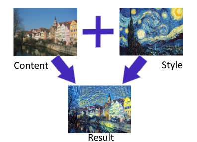
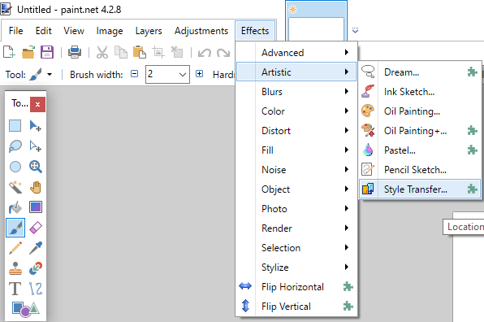
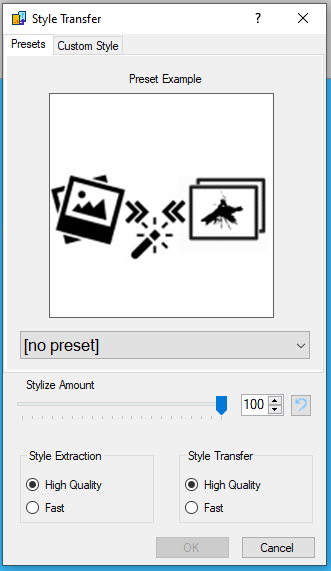
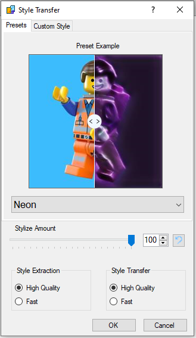
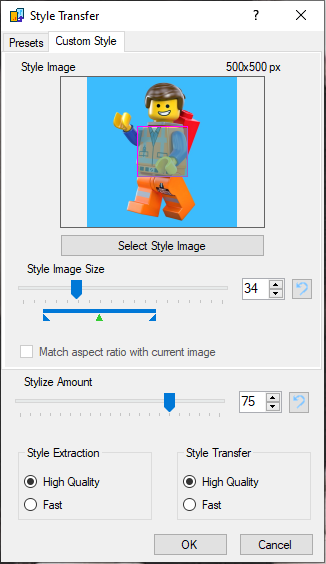
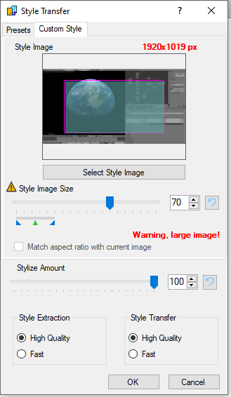

# A Paint.NET Effect Plugin based on Arbitrary Style Transfer

This plugin makes [Neural Style Transfer](https://en.wikipedia.org/wiki/Neural_Style_Transfer) available in the free and popular Pain.NET image editing software.

## Introduction

In neural style transfer, the style of an image is extracted and transferred to another image. The technique has become popular in recent years and can yield very interesting results. Here's an example using the painting “The Starry Night” by Vincent van Gogh:

Most implementations use a single style or very limited set of styles and deliver high quality results. This plugin is more of an exploratory tool for art and fun, and uses arbitrary neural style transfer as described in the paper [Exploring the structure of a real-time, arbitrary neural artistic stylization network](https://arxiv.org/abs/1705.06830) by Ghiasi, et. al.
The models where ported from pre-trained versions available in the [Magenta repository](https://github.com/tensorflow/magenta/tree/master/magenta/models/arbitrary_image_stylization). This technique allows interpolating between styles. Instead of blending the original image and the stylised result, the content image style is extracted and can be mixed with the target style at a selectable ratio.

## Installation

The released version contains an installer that copies the plugin and all its required dependencies and data to the Paint.NET-Effects folder automatically.

(If you just want to try it out, download the installer directly from [**HERE**](https://github.com/patlevin/pdn-styletransfer/releases/download/v1.1/StyleTransferEffect-Installer.exe) - requires the latest Paint.NET 4.2.16+)

### System requirements

* Windows 7 or better, **64-bit** version
* **lots** of RAM (16 GB+ recommended, but will work fine with 8GB as well)
* Paint.NET version 4.2 or newer (tested with PDN 4.2.8)
* a fast CPU (the plugin doesn't support GPUs at the moment)

## Using the plugin

After the installation, the plugin can be found in, and selected from Paint.NET's "**Effects**"-menu in the section "**Artistic**":

### Selecting presets

The first tab of the plugin lets you select a preset from a selection of styles extracted from random images. To avoid copyright issues, none of the style images are contained in the plugin or its source.
After selecting a style, a sample image with the style applied is shown. This example image features a movable slider for a nice "before and after"-effect:

The "Stylize Amount"-slider lets you adjust the ratio between the selected style and the content image style. Note that this is not a simple alpha-blend, though.
Even selecting zero ("0") will change the content image significantly, as the model tries to apply the style extracted from the content to the content itself. This process isn't perfect by any means, so keep that in mind.

"Style Extraction" and "Style Transfer" models can be selected as well. The "High Quality" setting uses a larger model for extracting and transferring styles. The "Fast"-option selects a smaller, "distilled" version of the higher quality one that requires less memory and less CPU power. The results will be very different between the models and depending on the selected style and amount, you might even prefer one over the other.

### Creating custom styles

The "**Custom Style**"-tab allows you to select your own style images and apply them:

Clicking the "**Select Style Image**"-button or clicking the style image preview directly, will open a file dialog for image selection. The "**Style Image Size**"-slider determines the relative scaling factor of the style image that is used before the style is analyzed. Think of it as how much of the style image the model is allowed to "see" before the style is extracted.
The colored bar below the slider indicates a size range that will probably yield the best-looking results, with the green arrow pointing at the recommended value.
You can select values outside this range (though RAM and minimum size restrictions still apply), but the results may not be as good.

The plugin will display a warning, if you choose a combination of a big style image and large style size:

This happens, because the processing requires a large amount of RAM and once you use more RAM than is physically installed in your computer, your system will crawl to a halt, become unresponsive, and eventually even crash Paint.NET.
The plugin will not use your settings, if they would result in too much RAM being used to protect the system from running out of memory.

## How it works

The plugin will first determine whether it can proecess the content image as a whole. Since the AI models use a lot of RAM, not all image sizes can be processed while still fitting in the computer's memory. Big images will therefore be divided into tiles, which are processed separately. This means, that the style transfer doesn't apply to the image as a whole in such cases, resulting in artifacting at the tile boundaries.
In order to mitigate this effect somewhat, the algorithm creates a set of overlapping tiles that will be blended into each other. This works well in general, but results may vary depending on image size and -content.
The amount of available RAM also affects the resulting quality as larger tiles means fewer tiles, and thus less potential artifacting...

The selected style image also affects the results (duh!), but not necessarily in a way that's obvious. This is actually the beauty of the effect (at least in my eyes), as you never quite get what you'd expect. Part of this comes from the limited training data and -time on the AI models used - specialised models that have been trained on a single image style or a small set of styles, perform much better.

Another factor is the amount of information that can be captures during style extraction. The model uses a 100-element style vector and trying to capture the essence of a mega-pixel artwork in just 100 numbers is... challenging, to say the least.

This is also where the styleimage size setting comes into play. Selecting a smaller value will remove details and focus on "the big picture", while values that are too big might simply fail to capture any meanful data during the style extraction process.

## Building from source

Building from source requires Visual Studio 2019 (available for free [here](https://visualstudio.microsoft.com/vs/)).
Presets cannot be recreated from the source code just to avoid any potential copyright issues. All dependencies are includes, except for the NuGet-packages.
The NuGet-packages will be acquired automatically by Visual Studio.
The included [ONNX runtime](https://microsoft.github.io/onnxruntime/) is a custom build using the CPU-backend with multi-core optimizations enabled.

## Future improvements

I tried to pack as much into the plugin as I deemed necessary to make it useful and fun to play with. There are, however, a few things that I skipped, just to get it out the door first:

* GPU-support
* RAM-usage optimisations
* combining multiple styles
* user-created presets
* support for cancel while processing the effect
* advanced options (tiling overlap, blend modes)
* improved AI models

## GPU support

GPU-support is is a tough one. Not because it's hard to include - the ONNX runtime that does the model processing includes support for it - but because it's hard to decide on the direction to take while doing this.
First there's the elephant in the room: NVIDIA's proprietary CUDA. Using CUDA has several disadvantages:

1. You're locked to a single CUDA version, because AFAIK the libraries are not upwards compatible. The user also needs to have the CUDA version installed that you built against.
2. It locks out all users of APUs, IGPUs, and non-NVIDIA hardware in general.

There are a few alternatives, though:

* Microsoft's [DirectML](https://docs.microsoft.com/en-us/windows/win32/direct3d12/dml-intro) - a hardware-agnostic API that sits on top of Direct3D 12 and DirectCompute
* [Vulkan](https://www.khronos.org/vulkan/) - a platform independent, low-level graphics and compute API
* [OpenCL](https://www.khronos.org/opencl/) and [SYCL](https://www.khronos.org/sycl/) - an open standard implemented by many hardware vendors, and supported from GPUs to dedicated FPGAs
* [OpenGL|ES](https://www.khronos.org/opengles/) - the "embedded" version of OpenGL that forms the basis of WebGL

DirectML is very recent and not very mature. The ONNX runtime support is very limited and doesn't implement the feature set required by the style transfer models.
Unfortunately, DirectML is the only non-CUDA option for hardware acceleration that is currently available with the ONNX runtime.
Building a SYCL or OpenGL|ES-based custom runtime provider would be a substantial project in and of itself...
